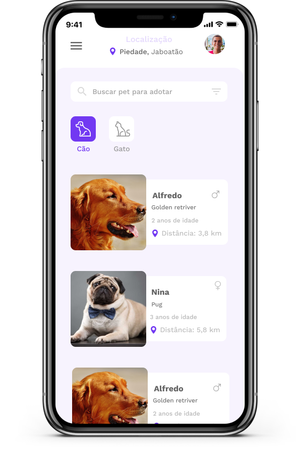

<h1 align="center">
  
</h1>

<h3 align="center"> This is a project about animal donation<h3>

 

  

## :star: Features

This project features all the latest tools and practices in mobile development!

- ⚛️ **React Native** — A lib that provides a way to create native apps for Android and iOS

## :electric_plug: Getting started

1. Clone this repo using: `https://github.com/joao-lucas-dev/petbuddy-mobile.git`
2. Move yourself to the appropriate directory: `cd petbuddy-mobile`
3. To install all dependencies, run: `yarn`
4. If you use IOS, run: `cd ios` after `pod install`
5. Come back to directory: `petbuddy-mobile`.
6. Run `react-native run-ios` (or `run-android if your prefer) to start the mobile app

